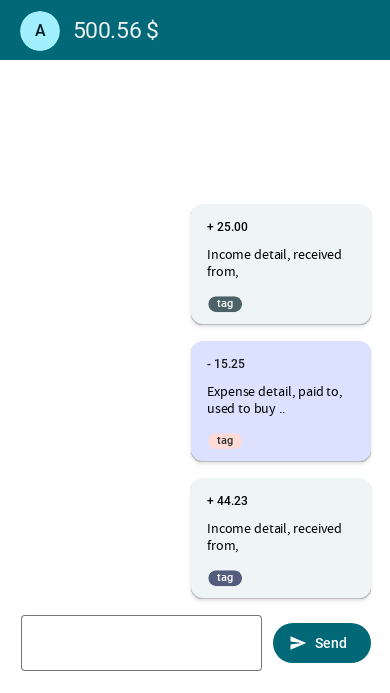

# Spencer

An (AI powered?) app that helps you keep track of your expenses .. The Cool Way 😉.

Coming soon 🚀  


## Architecture

**Clean Architecture** with feature-based modules:

```
UI Layer (app/, features/*/ui)
  ↓ uses
React Query (data fetching, caching)
  ↓ uses
Use Cases (features/*/features/*/use-case.ts)
  ↓ uses
Repositories (features/*/infra/*-repo.ts)
  ↓ uses
Drizzle ORM → SQLite (expo-sqlite)
```

## Project Structure

```
spencer/
├── app/                      # App entry, main screens
│   ├── _layout.tsx           # Root layout with AppBar context
│   └── index.tsx             # Main chat interface
├── assets/                   # Static assets
│   ├── fonts/                # Custom fonts (SpaceMono)
│   ├── images/               # App icons, splash screens
│   ├── locales/              # i18n translations (en/, es/)
│   └── message-patterns.json # Patterns for parsing transaction messages
├── common/                   # Shared code
│   ├── components/           # Reusable UI components
│   ├── constants/            # App-wide constants (Colors, query-keys)
│   ├── hooks/                # Custom React hooks (use-dependency, useThemeColor)
│   ├── infra/                # Infrastructure (DI container, storage)
│   └── utilities/            # Helper functions
├── features/                 # Feature modules
│   ├── tags/                 # Tags management
│   │   ├── domain/           # Types, interfaces
│   │   ├── common/infra/     # Repositories
│   │   └── features/         # Use cases + React Query hooks
│   └── transactions/         # Transaction management (same structure)
├── providers/                # React context providers
│   ├── deps-provider.tsx     # Awilix DI container provider
│   └── migrations-provider.tsx # Drizzle ORM migrations
├── stores/                   # Zustand stores
│   └── localization.store.ts # Language preference
├── App.tsx                   # Root component
├── app.json                  # Expo configuration
├── drizzle.config.ts         # Drizzle Kit config
├── tailwind.config.js        # Nativewind Tailwind config
├── tsconfig.json             # TypeScript with path aliases
└── babel.config.js           # Babel config
```

## Key Technologies

| Category | Packages |
|----------|----------|
| **Framework** | expo@54, react-native@0.81.5, react@19.1.0 |
| **Routing** | expo-router@6.0.24 |
| **State** | zustand@5.0.0-rc.2, @tanstack/react-query@5.51.1 |
| **ORM** | drizzle-orm@0.36.4, expo-sqlite@16.0.10 |
| **DI** | awilix@10.0.2 |
| **UI** | react-native-paper@5.12.3, nativewind@2.0.11 |
| **i18n** | i18next@23.15.1, react-i18next@15.0.2 |
| **Forms** | react-hook-form@7.53.0, valibot@0.35.0 |

## Conventions & Patterns

### 1. Feature Organization
```
features/{feature-name}/
  domain/          # Types, interfaces
  common/infra/   # Repositories, adapters
  features/       # Use cases + React Query hooks
    {use-case}/
      {use-case}.use-case.ts
      use-{use-case}.ts
```

### 2. Dependency Injection (Awilix)
```typescript
// Registration (common/infra/deps-container.ts)
container.register({
  transactionsRepo: asFunction(makeDrizzleTransactionsRepo).singleton(),
});

// Usage (common/hooks/use-dependency.ts)
const repo = useDependency<TransactionsRepo>('transactionsRepo');
```

### 3. Chat-Based Transaction Entry
Messages follow pattern: `[+-] amount description #tag1 #tag2`
Parsed via `transaction-pattern-finders.ts`

### 4. TypeScript Path Aliases
```typescript
// tsconfig.json
"paths": {"@/*": ["./*"]}

// Usage
import {Tag} from '@/features/tags/domain/tag';
```

### 5. Styling
- **Nativewind**: Tailwind CSS classes via `className` prop
- **React Native Paper**: Material Design components
- **Utility**: `cn()` for conditional class merging

### 6. Database Schema (Drizzle ORM)
```
transactions (id, description, isExpense, amount)
tags (id, value)
tagsToTransactions (tag_id, transaction_id) [composite PK]
```

### 7. Code Style

**Prettier Configuration** (`.prettierrc.js`):
```javascript
module.exports = {
  bracketSameLine: true,
  singleQuote: true,
  trailingComma: 'all',
  arrowParens: 'always',
  tabWidth: 4,
  bracketSpacing: false,
  semi: true,
};
```

**Rules:**
- **Quotes**: Single quotes (`'`)
- **Indentation**: 4 spaces (tabs not used)
- **Semicolons**: Required (`;`)
- **Trailing commas**: Always (`'all'`)
- **Arrow functions**: Always use parentheses (`(x) => x`)
- **Brackets**: No space inside (`{a}` not `{ a }`), same line for opening bracket
- **Linter**: Expo lint (ESLint) via `npm run lint`

### 8. Testing & Accessibility

**For e2e testing (Detox & Maestro):**

Use both `testID` and `accessibilityLabel` on interactive elements:

```tsx
<Button
  testID="add-transaction-btn"      // For testability
  accessibilityLabel="Add transaction" // For a11y + testing fallback
  onPress={handleAdd}
>
  Add transaction
</Button>

<TextInput
  testID="transaction-input"
  accessibilityLabel="Transaction amount and description"
  placeholder="Enter transaction"
/>
```

| Prop | Purpose | Detox | Maestro |
|------|---------|-------|---------|
| `testID` | **Testability only** - Stable, tech-agnostic identifier | `by.id('test-id')` | `{id: 'test-id'}` |
| `accessibilityLabel` | **Accessibility + testing fallback** - Screen reader text, also usable as test selector | `by.label('label')` | `{id: 'label'}` |

**Best practices:**
- Always use `accessibilityLabel` on interactive elements (improves a11y)
- Add `testID` for critical test paths (more stable than text)
- Avoid relying on visible text for selectors (brittle with i18n)

## Contributor guide

### Dev environment setup

#### Requirements
